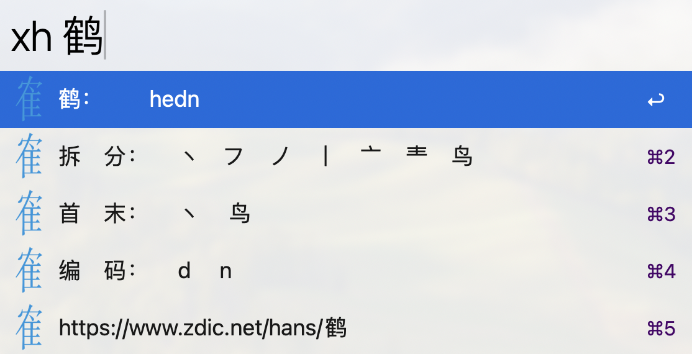

# alfred-workflow-xhyx for Alfred 5
小鹤音形编码查询

源自[alfred-workflow-xhyx](https://github.com/liubiantao/alfred-workflow-xhyx)，适配最新EMS，支持Alfred 5，修改支持的音形编码展示不正确。

## [点击下载](https://github.com/Shuyun123/alfred-workflows-xhyx/raw/master/xhyx.alfredworkflow)

## 需求
1. [Alfred App v5](http://www.alfredapp.com/#download)

## 安装
1. 点击上面的下载按钮
2. 双击导入 Alfred

## 查询命令
- `xh {query}`

